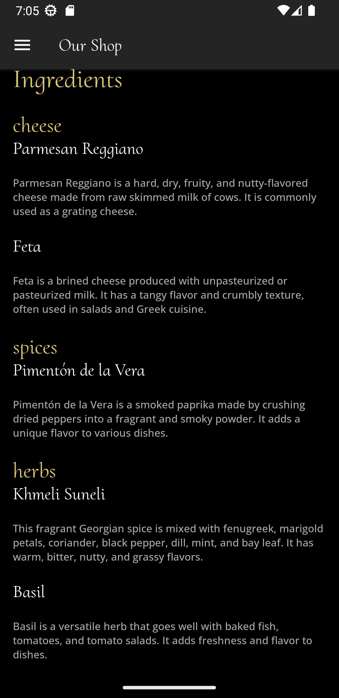

# Wine And Dine (Native)


Welcome to Wine And Dine, a personal project crafted with React Native and Firebase to bring you an immersive and delightful restaurant experience. Wine And Dine combines the power of Firebase's robust backend infrastructure with the flexibility and efficiency of React Native to create a seamless and dynamic mobile application.

With React Native, we can deliver a native-like user experience across both iOS and Android platforms, ensuring a smooth and responsive interface for all users. Firebase's real-time database and authentication services enable features like real-time updates on menus, reservation status, and user authentication, making the app engaging and interactive.


## Tech Stack

React-Native and Typescript


## Run Locally

Clone the project

```bash
  git clone git@github.com:Armaan-Singh-Dhillon/WineAndDineNative.git
```

Go to the project directory and install the dependencies

```bash
  npm install
```

Run the app on an Emulator or a Physical Device

```bash
   expo start
```


## Screenshots





## Color Reference

| Color            | Hex                                                              |
| ---------------- | ---------------------------------------------------------------- |
| Background Color |  #000          |
| Borders          |  #dcc87a |
| Text Color       |  #fff          |

## Features

- The mobile application is built using React Native, a popular framework that allows for cross-platform development, enabling the app to work on both iOS and Android devices.
- React Navigation is used to implement smooth screen transitions and navigation within the mobile app, providing a seamless user experience.
- Firebase Cloud Storage is utilized to store and serve images and other media files in the mobile app, ensuring efficient retrieval and delivery of assets.
- Firebase Firestore SDK is integrated into the app to manage and synchronize real-time data, providing users with up-to-date information and a seamless experience.
- Firestore SDK for real-time data synchronization and efficient data management
- Firebase Authentication is implemented to allow users to securely sign in to the mobile app, ensuring that only authorized users can access certain features or data.
- React Native's navigation system and conditional rendering are used to handle different app screens and layouts based on user interactions, allowing for dynamic content delivery.


## Support

For support, email dhillonarmaan2004@mail.com

## Developer

- [@Armaan-Singh-Dhillon](https://github.com/Armaan-Singh-Dhillon)
